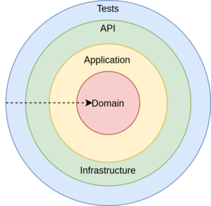

# MeuAcerto.Selecao.KataGildedRose

Aplicação desenvolvida durante o processo seletivo da Meu Acerto.

Se trata de uma reinterpretação do famigerado kata Gilded Rose, porém com bastante liberdade para mudanças.

O projeto foi reestruturado para uma nova arquitetura visando uma melhor organização para possíveis futuras mudanças e adições

## Arquitetura



A arquitetura do projeto foi inspirada pelos conceitos do Domain-driven desing (DDD) e pela clean-architeture, porém não seguindo estritamente nenhuma das duas.

### Camadas

#### 1. Domain

A camada Domain, é onde se encontram informações sobre o nosso domínio. E nela que se encontram as nossas Entidades, Enums, abstrações dos nossos casos de uso, e qualquer coisa relacionado ao nosso domínio de negócio que seja independente do sistema.

#### 2. Application

A camada Application contém as abstrações necessárias para automatizar nossos casos de uso, e também fornecer serviços para possíveis aplicações.

#### 3. Infrastructure

Na Infrastructure se encontram as implementações de nossos serviços de infraestrutura. É aqui que temos implementações relacionadas ao banco de dados.

#### 4. API (Startup Project)

A camada API é onde se encontra a implementação da API, é nela que configuramos as rotas (através das controllers) e a injeção de dependência.

#### 5. Tests

Na camada de testes se encontram todos os testes dos sistemas. Atualmente existem dois tipos de testes: os unitários e os de aprovação.

### Tecnologias

Além do .NET 5 e do ASP.NET Core, foram utilizadas as seguintes tecnoloigias:

- FluentValidation: para controlar as validações das entidades;

- Dapper: Para o mapeamente entre: resultados de comando e queries => Objetos;

- Postgresql e Npgsql: como banco de dados e seu respectivo driver;

- Swagger (Swashbuckle): Para documentação da API;

- Xunit e ApprovalTests: Para os testes unitários;

- FluentAssertions: Para as asserções dos testes unitários;

### App

Foi feito uma single-page application básica utilizando o Blazor WebAssembly que lista os items persistidos e provêm um botão para atualizar a qualidade dos mesmos. Também foi utilizado os componentes do MudBlazor para terem uma melhor aparência.

## Uso

Existem 2 opção configuradas para rodar o sistema:

- Local (Profile testado com o Rider)

- Docker

### Local

Como o banco de dados só está configurado para ser rodado com o Docker, é necessário subir ele primeiro:

```bash
docker-compose up gildedrosedb
```

Com o banco online, basta adicionar o launchSettings.json da Api e/ou APP a sua IDE e executar cada um.

### Docker

Basta executar o seguinte comando na raiz do projeto:

```bash
docker-compose up -d
```

OBS: Necessita do docker e do docker-compose

#### Portas

| Projetos/Ambientes | Local | Docker (host) | Docker (container) |
| ------------------ | ----- | ------------- | ------------------ |
| Banco de Dados     | -     | 5433          | 5432               |
| API                | 5000  | 5004          | 80                 |
| APP                | 5002  | 5006          | 80                 |

Caso tenha problemas com as portas/endereços, eles podem serem configurados no .env, nos appsettings.json de cada projeto e no docker-compose.yml

## Possíveis soluções

- Erro ao subir o container do banco: Delete a pasta `database/postgres-data` (Também é útil para resetar o seed)

- Erro ao subir os containers da API e do APP: Tente reconstruir os serviços
  
  - ```bash
    docker-compose build --no-cache gildedroseapp
    ```
  
  - ```bash
    docker-compose build --no-cache gildedroseapi
    ```